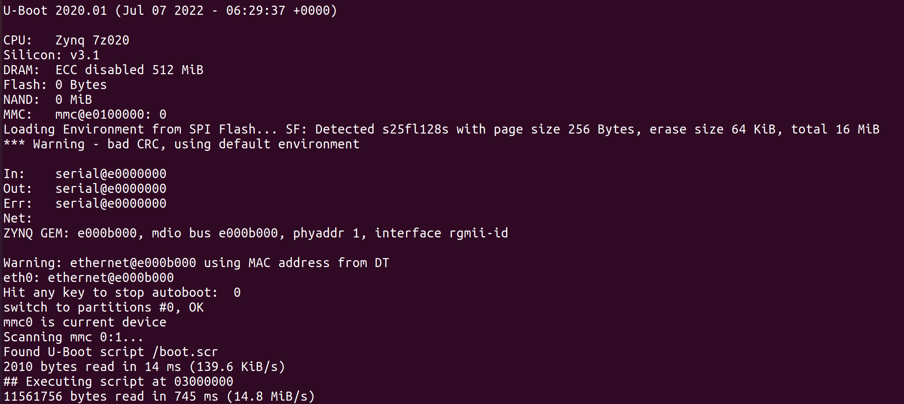
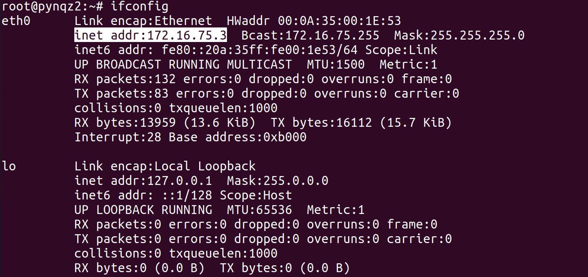
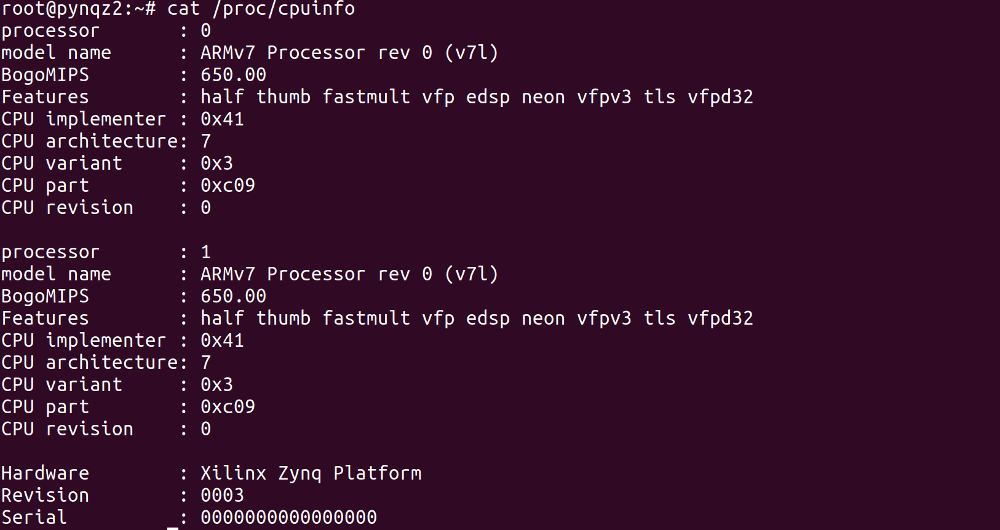
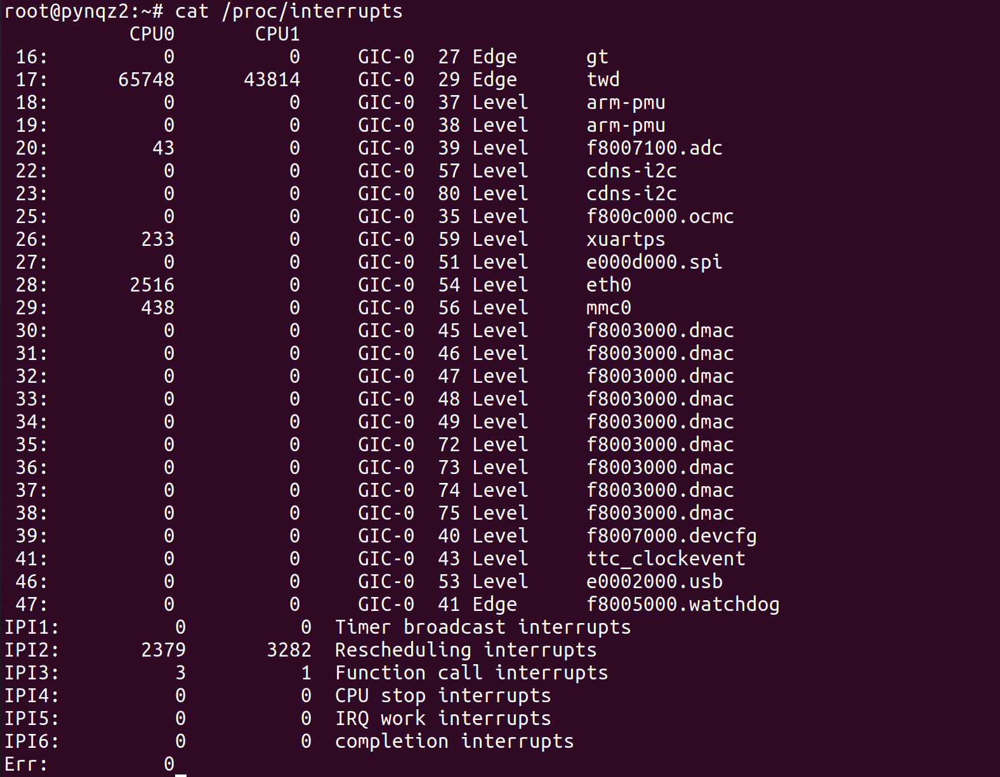
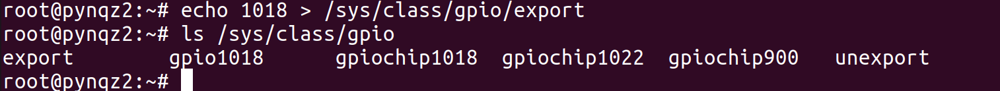

# Zynq Linux System

## Objectives
After completing this lab, you will be able to:
* Boot linux on Zynq using SD card and log in.
* Get familiar with the Zynq Linux System
* Using Linux driver to control the GPIOs

## Steps
### Prepare SD card and boot the Zynq Linux System.
1. Create **two** partitions on the SD card. The first partition should be **FAT32** format and with a size around 100MB. The second partition should be **ext4** format.
1. Copy the boot files (**BOOT.bin**, **boot.scr**, **image.ub**) from **{sources}/lab1** into the FAT32 partition of SD card.
1. Extract the Root File System (**{sources}/lab1/rootfs.tar.gz**) into the ext4 partition of SD card.
1. Connect the serial port on the board to your workstation and power on the board.
1. Start a serial communication (For example: minicom, kermit, gtkterm) with baud rate 115200.
1. Power off the board.
1. Set the boot mode of the board to SD and plug in the SD card.
1. Plug in a ethernet cable with internet access if possible.
1. Power on the board. A boot message should display on the serial terminal.
    <p align="center">
    
    </p>
    <p align = "center">
    <i>Zynq Booting Message</i>
    </p>
1. When prompt to log in, enter **root** for both username and password.

### Exploring the Embedded Linux Environment
#### Explore the booting message and basic linux commands
1. Scroll up in the serial terminal and review the boot log. You will see kernel loading, drivers loading such as USB, SD, etc., and starting of the SSH server.
1. Exploring basic Linux commands such as `ls`, `vi`, `whoami`, `date`.
1. Using `ping` command to test the network connection. For example, try to ping the host machine: `ping 192.168.1.1`
1. Type `ifconfig` to view the network interface and find the IPv4 address of the board. Try to log in the board by ssh from another console: `ssh root@<ip address>`
    <p align="center">
    
    </p>
    <p align = "center">
    <i>Network Interface</i>
    </p>

#### Find the CPU information and interrupts
>An interesting place to explore is the **/proc** directory. This is a virtual directory that provides a window into the kernel. For example, the file **/proc/cpuinfo** contains details about the CPU, **/proc/interrupts** provides interrupt statistics, and so on.
1. Enter the following command
    ```shell
    cat /proc/cpuinfo
    ```
    The contents of /proc/cpuinfo shows the processor information, such as its version and hardware features.
    <p align="center">
    
    </p>
    <p align = "center">
    <i>Viewing the CPU information</i>
    </p>

1. Enter the following command
    ```shell
    cat /proc/interrupts
    ```
    /proc/interrupts shows the interrupts information of the system, it tells you what interrupts are present in your system, their type, and how many interrupts have happened.
    <p align="center">
    
    </p>
    <p align = "center">
    <i>Viewing the Interrupts</i>
    </p>

### Test the GPIOs using the provided application.
1. Using following command to view the available GPIOs in the system
    ```shell
    ls /sys/class/gpio
    ```
    <p align="center">
    
    </p>
    <p align = "center">
    <i>Checking for the available GPIOs</i>
    </p>
1. The GPIOs are presented as `gpiochip<ID>`. Have a look at the file `gpiochip<ID>/label`. For example: `cat /sys/class/gpio/gpiochip1018/label`.
    <p align="center">
    
    </p>
    <p align = "center">
    <i>GPIO Physical Address Information</i>
    </p>

    The GPIO label file contains the GPIO's physical address information.
1. In this lab, the `gpiochip<ID>` to GPIOs mapping on Pynq-Z2 board is
    * gpiochip1018 for 4 LEDs
    * gpiochip1022 for 2 switches

#### Light up the LEDs
1. Using following command to export a LED GPIO.
    ```shell
    echo 1018 > /sys/class/gpio/export
    ```
    You should see a new folder in `/sys/class/gpio` with name `gpio1018`
    <p align="center">
    
    </p>
    <p align = "center">
    <i>Export a GPIO</i>
    </p>

    >Here the number 1018 is for LED0, you can try the other three LEDs by replacing 1018 with 1019, 1020, or 1021 in above and following steps

1. Set the GPIO direction to OUT.
    ```shell
    echo "out" > /sys/class/gpio/gpio1018/direction
    ```
1. Set the GPIO value to 1.
    ```shell
    echo "1" > /sys/class/gpio/gpio1018/value
    ```
    You shoud see the lighting up of LED0.
1. Set the GPIO value to 0.
    ```shell
    echo "0" > /sys/class/gpio/gpio1018/value
    ```
    The LED0 shoud truns off.
1. Unexport the GPIO.
    ```shell
    echo "1018" > /sys/class/gpio/unexport
    ```

#### Read the value of switches
1. Export a switch GPIO.
    ```shell
    echo "1022" > /sys/class/gpio/export
    ```

    >Using 1022 for SW0 and 1023 for SW1
1. Set the GPIO direction to IN.
    ```shell
    echo "in" > /sys/class/gpio/gpio1022/direction
    ```
1. Read the GPIO value.
    ```shell
    cat /sys/class/gpio/gpio1022/value
    ```
1. Toggle SW0 and read the value again.
1. Unexport the GPIO.
    ```shell
    echo "1022" > /sys/class/gpio/unexport
    ```
1. Power off the board.

## Conclusion
This lab introduce you to the Zynq Embedded Linux System. As an application and user environments, it has tremendous commonality with standard desktop Linux platforms. Although brief, this introduction should have provided you with some basic experience with setting up and powering on the board, logging into and navigating around the embedded Linux target.