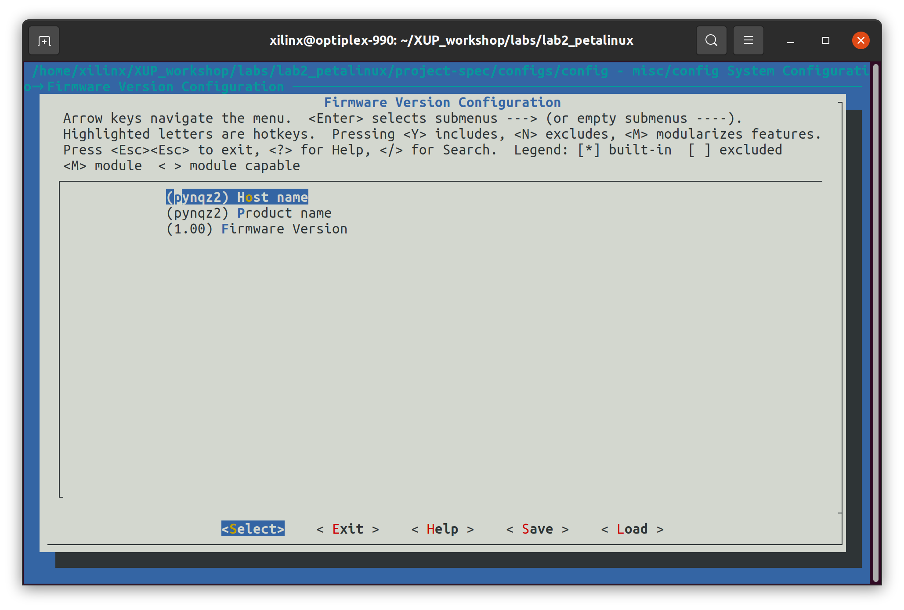

# Build and Boot an Image

## Objectives
After completing this lab, you will be able to
* Create a hardware using Vivado
* Configure and Build a ARM Cortex-A9 Linux Kernel and Root File System using PetaLinux

## Steps
1. Open a console and setup the Vitis environment.
    ```shell
    source <Vitis Installation Path>/settings64.sh
    ```
1. Launch Vivado by entering `vivado`
1. Click on **Create Project**. Enter **lab2** as the Project name, **{labs}** as the Project location. Check the box **Create project subdirectory**. Click **Next**.
1. Select **RTL Project** and check the box **Do not specify sources at this time**. Click **Next**
1. In the Default Part window, select the Boards tab, search and select **pynq-z2** or other boards you are using. (If you can't find the board you are looking for, refer to [README.md]() for setup.) Click Next.
1. Click Finish to create an empty Vivado project.

### Create a Block Design and add two instances of GPIO
1. Click on **Create Block Design** from the Project Manager.
1. Enter **system** as the name, and click **OK**.
1. Click on the **Add** button. Search for **zynq** and double-click on **ZYNQ7 Processing System** to add it to the design.
    <p align="center">
    
    </p>
    <p align = "center">
    <i>Add the Processing System</i>
    </p>
1. Click on **Run Block Automation** and click **OK**.
1. Click on the **Add** button, search and add a **AXI GPIO**.
1. Click on the AXI GPIO block to select it, and in the Block Properties tab, change the name to **leds**.
1. Double-click on the AXI GPIO block to open the customization window.
1. Click the **Board** tag, from the **Board Interface** drop down, select **leds 4bits** for GPIO. Click **OK**.
    <p align="center">
    
    </p>
    <p align = "center">
    <i>Config the AXI GPIO</i>
    </p>
1. Click on **Run Connection Automation** and select **All Automation**. Click **OK**.
1. Add another AXI GPIO block with name **buttons**.
1. Double-click on the buttons block, select **sws 2bits** for GPIO IP Interface. Click **OK**.
1. Click on **Run Connection Automation** again and select **All Automation**. Click **OK**.
1. Click the **Regenerate Layout** button and the blocks will be rearranged. The completed diagarm should look similar to this:
    <p align="center">
    
    </p>
    <p align = "center">
    <i>Completed Block Design</i>
    </p>
1. Click on the **Address Editor** tab and take a note of the base address of leds and buttons.
1. Click the **Validate Design (F6)** button and make sure there are no errors.

### Generate Bitstream and Export the Hardware
1. In the sources panel, right-click on **system.bd**, and select **Generate Output Products...**. Click **Generate** to generate the Simlation, Synthesis, and Implementation files for the Design.
    <p align="center">
    
    </p>
    <p align = "center">
    <i>Generate Output Products</i>
    </p>
1. Right-click again on **system.bd**, and select **Create HDL Wrapper...** to generate the top-level HDL module. Leave the **Let Vivado manager...** option selected, and click **OK**.
1. Click on **Generate Bitstream**, and click **Yes** if prompted to launch Implementation. Click **Yes** if prompted to save the design. Click **Cancel** when finished.
1. Export the hardware by clicking **File > Export > Export Hardware** and click **Next**.
1. Select **Include bitstream**, and click **Next**.
1. Click **Finish**.
1. A **.xsa** file should be created in the folder **{labs}/lab2**

### Configure and Build the Linux kernel and Root File System
#### Create a new PetaLinux project
1. Open a console and setup the environment for PetaLinux:
    ```shell
    source <PetaLinux Installation Path>/settings.sh
    ```
1. Change the path to **{labs}** using `cd` command.
1. Create a PetaLinux project using the BSP provided in **{sources}/lab2**:
    ```shell
    petalinux-create -t project -s {labs}/lab2/pynqz2.bsp --name lab2_petalinux
    ```

#### Import Hardware Configuration 
1. Run the following command:
    ```shell
    cd lab2_petalinux
    ```
    ```shell
    petalinux-config --get-hw-description ../lab2/*.xsa
    ```
    This launches the top system configuration menu. Using the keyboard arrows and Enter to navigate.
1. Go to **Firmware Version Configuration**, and change the **Host name** and **Product name** to **pynqz2**
    <p align="center">
    
    </p>
    <p align = "center">
    <i>Top system configuration menu</i>
    </p>
1. Save and exit the menu.

#### Configure kernel to enable GPIO drivers (Optional)
>Usually the GPIO is enabled in the kernel by default and this section can be skipped.
1. Run the following command:
    ```shell
    petalinux-config -c kernel
    ```
    Wait for a few minutes to launch the kernel configuration menu.
1. Navigate to **Device Drivers > GPIO Support**, select **/sys/class/gpio/...** and press **Y** to enable the sysfs interface for GPIOs.
    <p align="center">
    
    </p>
    <p align = "center">
    <i>Enable sysfs interface for GPIOs</i>
    </p>
1. Go to **Memory mapped GPIO drivers**, and enabe **Xilinx GPIO support**.
    <p align="center">
    
    </p>
    <p align = "center">
    <i>Enable Xilinx GPIO driver</i>
    </p>
1. Save and exit the menu.

#### Configure rootfs to enable TCF agent
1. Run the command:
    ```shell
    petalinux-config -c rootfs
    ```
    It will launch the rootfs confguration menu.
1. Navigate to **Filesystem Packages > misc > tcf-agent**, and make sure **tcf-agent** is enabled.
    <p align="center">
    
    </p>
    <p align = "center">
    <i>Enable TCF agent</i>
    </p>
1. Save and exit the menu.


#### Build the PetaLinux project and Generate Boot files
1. Run the command `petalinux-build`, it will automatically build everything we need including kernel, rootfs, device tree, FSBL, and u-boot. The compilation may last for few hours depending on your network and the number of CPUs.
1. When the compilation finished, run the following command to package the boot files:
    ```shell
    petalinux-package --boot --fpga --u-boot
    ```
    It will show a success message when finished.
1. Find the boot files (**BOOT.BIN, boot.scr, image.ub**) and the root file system (**rootfs.tar.gz**) in the folder **{labs}/lab2_petalinux/images/linux/**.

### Verify on Hardware
1. Follow the instruction in lab1 to configure and boot the board using the image files generated in this lab.
1. Check the physical address of each gpiochip to decide the ID of leds and switches
    ```shell
    cat /sys/class/gpio/gpiochip<ID>/label
    ```
    It should be the same as in the Vivado Address Editor
    <p align="center">
    
    </p>
    <p align = "center">
    <i>Vivado Address Editor</i>
    </p>
1. Follow the instruction in lab1 to test the LEDs and switches.
1. When satisfied, power off the board.

## Conclusion
In this lab, you learned how to create and export a hardware design in Vivado, the exported hardware description can be imported in PetaLinux. You also learned how to create a PetaLinux project from a BSP and cross-compile a Linux image.