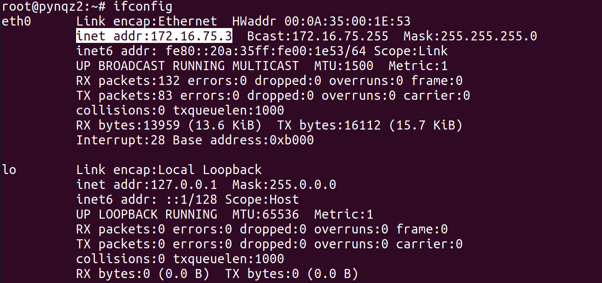
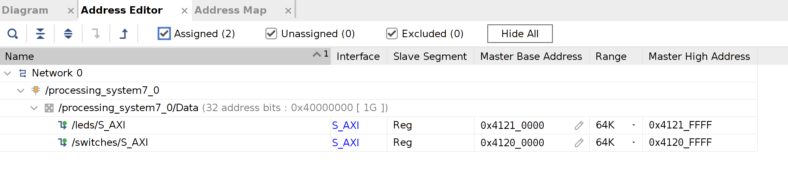

# Writing Basic Linux Application in Vitis IDE
## Objectives
After completing this lab, you will be able to
* Create platform with Linux domain in Vitis IDE.
* Write a basic application to access the hardware via /dev/mem.
* Verify on a Zynq board through TCF agent.

## Steps
### Create a Vitis Platform with Linux domain
1. Setup Vitis environment: `source <Vitis Installation Path>/settings64.sh`
1. Launch Vitis IDE: `vitis`
1. Click on **File > New > Platform Project...**, click **Next** to skip the welcome page if necessary.
1. Enter **lab3_platform** as the name. Click **Next**.
1. Click the tab **Create a new platform from hardware (XSA)**, and browse to select the **.xsa** file exported in lab2 (in folder **{labs}/lab2/**). Click **Open**.
1. Select **linux** as the Operatng system and uncheck the box **Generate boot components**. Click **Finish**.
    

    
    

    

    <i>Create Platform Project</i>
    

1. Build the platform project by clicking on the **hammer** button.

### Create the Application in Vitis IDE
1. Click on **File > New > Application Project...**, click **Next** to skip the welcome page if necessary.
1. Click the tab **Select a platform from repository** and select **lab3_platform \[custom\]**. Click **Next**.
1. Enter **lab3** as the project name, and click **Next**.
1. Click **Next**.
1. Select **Linux Empty Application** as the template. Click **Finish**
1. Right-click on **lab3_system > lab3 > src** from the Explorer and select **Import Sources...**.
1. Browse to select the folder **{sources}/lab3**, and click **Open**.
1. Select **gpio-dev-mem-test.c** and click **Finish**.
1. Open the file **gpio-dev-mem-test.c** and examine the code. 
    >We use `mmap()` to map the physical address to user space, and then read or write on sepcific offsets. The AXI GPIO peripheral has two registers: Offset 0x0 is the data register used to read or write the GPIO ports. Offset 0x4 is the direction register, which is used to configure the GPIO as an input (direction bit is "1") or an output (direction bit is "0").
1. Build the project by clicking the **hammer** button.

### Set up connection with TCF agent.
1. Follow the instruction in lab1 to set up the SD card and board using image files from lab2 or **{sources}/lab1**.
1. Enter the command `ifconfig` in the serial terminal, and find the IPv4 address assigned to the board.
    

    
    

    

    <i>Network Interface</i>
    

1. Back to Vitis IDE and click on **Window > Show View...**
1. Search to Open **Target Connections**.
1. Expand **Linux TCF Agent** and double-click to open **Linux Agent \[default\]**
    

    
    

    

    <i>Target Connections</i>
    

1. Enter the board's **IP address** as the Host, and **1534** as the Port.
    

    
    

    

    <i>Target Connections</i>
    

1. Click **Test Connection** and you should see a success mesage.
    

    
    

    

    <i>Test Connection</i>
    

1. Click **OK** to close the window.
### Run the application by writing to LEDs
The application has three arguments:
* `-g <GPIO_ADDR>` GPIO physical address
* `-i` Input from GPIO
* `-o <VALUE>` Output to GPIO
    
The physical address can be found in the Vivado Address Editor (from the Vivado project in lab2), **it may be different on your project**. Here the address of leds is **0x41210000** and the address of switches is **0x41200000**
    

    
    

    

    <i>Vivado Address Editor</i>
    

1. Right-click on **lab3_system > lab3** and select **Run As > Run Configurations...**
1. Right-click on **Single Application Debug** and select **New Configuration**. A new configuration with name **Debugger_lab3-Default** is created.
1. Click on the tab **Arguments** and type `-g 0x41210000 -o 1` (replace the address to your LED base address). Click **Apply** and click **Run**.
    

    
    

    

    <i>Run Configurations</i>
    

    You should see the lighting up of LED0 and message printed in Console.
    

    
    

    

    <i>Console Output</i>
    

1. Change the argument `-o` to other values (from 0 to 15), for example: `-g 0x41210000 -o 15`. Run the application again and observe the corresponding LED pattern on the board.

### Run the application by reading from switches
1. Open the **Run Configurations**, change the arguments to `-g 0x41200000 -i` (replace the address to your switch base address). Click **Apply** and click **Run**. Observe the message printed in the Console.
    

    
    

    

    <i>Console Output</i>
    

1. Toggle the switches and run the application again. You should see the input value changed.
1. When satisfied, power off the board.

## Conclusion
All the peripherals in linux are memory mapped, we can use /dev/mem to access them. Vitis platform with linux domain can be used to create Linux applications, and the applications can be debugged via Linux TCF agent.
